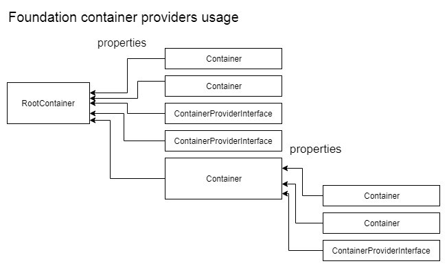

# Foundation container


`vndor\Foundation\Container` is a small Dependency Injection Container for PHP.

See https://github.com/GonistLelatel/Pimple

## Compatibility

Class `Container` implements interfaces.
```php
class Container implements \ArrayAccess, ContainerProviderInterface /*ContainerInterface*/;
```

Container is full compatible with original pimple-container, except patterns of "Dependency Injection and Service locator".<br>
Foundation-container use own api named "ContainerProviderInterface".<br>
Root-container `register` the provider-containers.<br>
Provider-containers `connectTo($Root-container)` and build the root-container properties.



## Usage

Creating a container is a matter of creating a ``Container`` instance:
```php
use vndor\Foundation\Container;

$container = new Container();
```

As many other dependency injection containers, `Container` manages two different
kind of data: **services** and **parameters**.

<details><summary><b>&#x1F535; Defining Factory Services</b></summary>
<p>

By default, each time you get a service, `Container` returns the **same instance**
of it. If you want a different instance to be returned for all calls, wrap your
anonymous function with the ``factory()`` method

```php
$container->session = $container->factory(function ($c) {
	return new Session( $c->session_storage );
});
```

Now, each call to `$container->session` returns a new instance of the
session.

</p>
</details>

<details><summary><b>&#x1F535; Defining Parameters</b></summary>
<p>

Defining a parameter allows to ease the configuration of your container from
the outside and to store global values:

```php
// Array interface
$container['cookie_name'] = 'SESSION_ID';
$container['session_storage_class'] = 'SessionStorage';
// Property interface
$container->cookie_name = 'SESSION_ID';
$container->session_storage_class = 'SessionStorage';
```

If you change the ``session_storage`` service definition like below:
```php
// Array interface
$container['session_storage'] = function ($c) {
	return new $c['session_storage_class']($c['cookie_name']);
};
```

You can now easily change the cookie name by overriding the
`cookie_name` parameter instead of redefining the service
definition.

</p>
</details>

<details><summary><b>&#x1F535; Protecting Parameters</b></summary>
<p>

Because `Container` sees anonymous functions as service definitions, you need to
wrap anonymous functions with the `protect()` method to store them as
parameters:

```php
// Property interface
$container->random_func = $container->protect(function () {
	return rand();
});
```

</p>
</details>

<details><summary><b>&#x1F535; Array access, property access</b></summary>
<p>

Container class using 2 api to access properties
* Array access
* Property access

```php
// Array
$container['cookie_name'] = 'SESSION_ID';
$container['session_storage_class'] = 'SessionStorage';
// Properties
$container->cookie_name = 'SESSION_ID';
$container->session_storage_class = 'SessionStorage';
```

</p>
</details>

<details><summary><b>&#x1F535; Reset to raw</b></summary>
<p>

"Reset to raw" using to reset variable or service to initial state or value.
```php
class Container {
	public function resetToRaw($id);
	public function resetToRawAll();
}
// ...
$container = new Container;
$container->__config_useFrozen = false;
// --
$container->i = 0;
$container->i++; // 1
$container->i++; // 2
$container->resetToRaw('i');

echo $container->i; // 0
$container->i++; // 1
```

</p>
</details>

<details><summary><b>&#x1F535; Freeze , unfreeze</b></summary>
<p>

"Freeze, unfreeze" functions allow to assign already calling variable, its disable the frozen feature.
```php
class Container {
	// by default all properties is frozen
	public $__config_useFrozen = true;
	public function unfreeze($id);
	public function freeze($id);
}
// ...
$container = new Container;
// --
$container->i = 0;
echo $container->i;
$container->i = 1; // throws !!!
// --
$container->i = 0;
echo $container->i;

$container->unfreeze('i');
$container->i = 1; // ok
echo $container->i;
$container->i = 2; // ok
```

</p>
</details>

<details><summary><b>&#x1F535; Modifying Services after Definition</b></summary>
<p>

In some cases you may want to modify a service definition after it has been
defined. You can use the ``extend()`` method to define additional code to be
run on your service just after it is created:

```php
// Array interface
$container['session_storage'] = function ($c) {
	return new $c['session_storage_class']($c['cookie_name']);
};

$container->extend('session_storage', function ($storage, $c) {
	$storage->...();
	return $storage;
});
```

The first argument is the name of the service to extend, the second a function
that gets access to the object instance and the container.

</p>
</details>

<details><summary><b>&#x1F535; Container Provider Interface</b></summary>
<p>

If you use the same libraries over and over, you might want to reuse some
services from one project to the next one; package your services into a
**provider** by implementing `vndor\Foundation\ContainerProviderInterface`:

```php
use vndor\Foundation\Container;
use vndor\Foundation\ContainerProviderInterface;

class FooProvider implements ContainerProviderInterface
{
	function connectTo(/*Container*/ $container) {
		$container->param = 'value';

		$container->service = function () {
			return new Service();
		};

		$container->createService = $container->factory(function () {
			return new Service();
		});
	}
}
```
Then, register the provider on a Application:

```php
class App extends Container
{
	public function __construct() {
		parent::__construct();

		$this->register( FooProvider::class );

		echo $this->param;
		print_r($this->service);
		print_r($this->createService);
	}
}
```

see [PimpleServiceProviderInterfaceTest.php](tests/PimpleServiceProviderInterfaceTest.php)
</p>
</details>

<details><summary><b>&#x1F535; Fetching the Service Creation Function</b></summary>
<p>

When you access an object, `Container` automatically calls the anonymous function
that you defined, which creates the service object for you. If you want to get
raw access to this function, you can use the ``raw()`` method:

```php
// Array interface
$container['session'] = function ($c) {
	return new Session($c['session_storage']);
};

$sessionFunction = $container->raw('session');
```

</p>
</details>

## Test running

* install __phpunit, composer, php__ if not installed
* run __composer install__ at package dir
* run __src/tests/startTest.bat__

On linux use *.sh files like *.bat files

For more features:
* Read source code and examples
* Practice with `vndor\Foundation\Container` in real code
